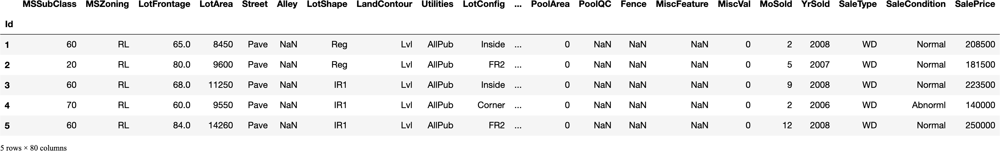

# Predicción del precio de venta de la propiedad

## 1. Introducción

### 1.1 Presentación del objetivo

En este proyecto vamos a trabajar la predicción de una variable cuantitativa mediante un conjunto de variables tanto cuantitativas como cualitativas. El objetivo en cuentión se trata de predecir el precio de venta de un bien inmueble, y para ello trabajaremos con la famosa base de datos de _kaggle_ _"House Prices - Advanced Regression Techniques"_, que contiene información sobre 1460 propiedades inmobiliarias (casas) vendidas en Ames, Iowa (EEUU). En concreto, tenemos a nuestra disposición 79 variables explicativas que nos describen muchas de las características de las viviendas, más allá de las típicas como el tamaño o la zona residencial. 


### 1.2 Habilidades que trabajaremos

__Ingeniería de atributos__: Una de las grandes ventajas de esta base de datos es que nos va a permitir trabajar de manera intensa la limpieza, transformación y selección de atributos, pues contamos con muchos de los casos que se nos pueden prensentar en un problema de este tipo, como son el trabajar con valores erroneos u omitidos, el manejo de variables altamente correladas o la necesidad de tener que seleccionar variables o reducir la dimensionalidad de nuestra base de datos.

__Visualización de datos__: Para este proyecto vamos a trabajar la visualización de datos con la librería _Seaborn_, que como veremos nos permite realizar gráficos de una manera muy sencilla y con un acabado realmente profesional.

__Tecnicas de regresión__: Finalmente trabajaremos distintas técnicas de regresión para realizar la predicción sobre los datos de test.


### 1.3 Flujo de trabajo 

Vamos a llevar a cabo nuestro proyecto siguiendo el siguiente _workflow_:

1. 


---

## 2. Preprocesamiento de datos y análisis exploratorio 

### 2.1 Carga de las librerías necesarias

Para este proyecto en concreto cargaremos las siguiente librerías:
- Pandas para trabajar con dataframes.
- Seaborn para la realización de gráficos.
- Scikit-learn para modelizar.


```python
import pandas as pd
#import seaborn as sns
```

### 2.2 Carga de los datos y primera aproximación

Lo primero que haremos será cargar los datos en un _dataframe_ de _Pandas_. Sabemos que los datos incluyen una columna llamada "Id" que nos servirá para indexar nuestros datos, así que en la carga le diremos a _Pandas_ que carge esa columna como índice con el atributo _index_col_.


```python
data = pd.read_csv('/Users/robertonavarretecansino/Proyectos/Python/Proyectos/Kaggle HOUSE PRICES/data/train.csv', index_col='Id')
data.head()
```


    

    


```python
data.head().to_html()
```


    '<table border="1" class="dataframe">\n  <thead>\n    <tr style="text-align: right;">\n      <th></th>\n      <th>MSSubClass</th>\n      <th>MSZoning</th>\n      <th>LotFrontage</th>\n      <th>LotArea</th>\n      <th>Street</th>\n      <th>Alley</th>\n      <th>LotShape</th>\n      <th>LandContour</th>\n      <th>Utilities</th>\n      <th>LotConfig</th>\n      <th>LandSlope</th>\n      <th>Neighborhood</th>\n      <th>Condition1</th>\n      <th>Condition2</th>\n      <th>BldgType</th>\n      <th>HouseStyle</th>\n      <th>OverallQual</th>\n      <th>OverallCond</th>\n      <th>YearBuilt</th>\n      <th>YearRemodAdd</th>\n      <th>RoofStyle</th>\n      <th>RoofMatl</th>\n      <th>Exterior1st</th>\n      <th>Exterior2nd</th>\n      <th>MasVnrType</th>\n      <th>MasVnrArea</th>\n      <th>ExterQual</th>\n      <th>ExterCond</th>\n      <th>Foundation</th>\n      <th>BsmtQual</th>\n      <th>BsmtCond</th>\n      <th>BsmtExposure</th>\n      <th>BsmtFinType1</th>\n      <th>BsmtFinSF1</th>\n      <th>BsmtFinType2</th>\n      <th>BsmtFinSF2</th>\n      <th>BsmtUnfSF</th>\n      <th>TotalBsmtSF</th>\n      <th>Heating</th>\n      <th>HeatingQC</th>\n      <th>CentralAir</th>\n      <th>Electrical</th>\n      <th>1stFlrSF</th>\n      <th>2ndFlrSF</th>\n      <th>LowQualFinSF</th>\n      <th>GrLivArea</th>\n      <th>BsmtFullBath</th>\n      <th>BsmtHalfBath</th>\n      <th>FullBath</th>\n      <th>HalfBath</th>\n      <th>BedroomAbvGr</th>\n      <th>KitchenAbvGr</th>\n      <th>KitchenQual</th>\n      <th>TotRmsAbvGrd</th>\n      <th>Functional</th>\n      <th>Fireplaces</th>\n      <th>FireplaceQu</th>\n      <th>GarageType</th>\n      <th>GarageYrBlt</th>\n      <th>GarageFinish</th>\n      <th>GarageCars</th>\n      <th>GarageArea</th>\n      <th>GarageQual</th>\n      <th>GarageCond</th>\n      <th>PavedDrive</th>\n      <th>WoodDeckSF</th>\n      <th>OpenPorchSF</th>\n      <th>EnclosedPorch</th>\n      <th>3SsnPorch</th>\n      <th>ScreenPorch</th>\n      <th>PoolArea</th>\n      <th>PoolQC</th>\n      <th>Fence</th>\n      <th>MiscFeature</th>\n      <th>MiscVal</th>\n      <th>MoSold</th>\n      <th>YrSold</th>\n      <th>SaleType</th>\n      <th>SaleCondition</th>\n      <th>SalePrice</th>\n    </tr>\n    <tr>\n      <th>Id</th>\n      <th></th>\n      <th></th>\n      <th></th>\n      <th></th>\n      <th></th>\n      <th></th>\n      <th></th>\n      <th></th>\n      <th></th>\n      <th></th>\n      <th></th>\n      <th></th>\n      <th></th>\n      <th></th>\n      <th></th>\n      <th></th>\n      <th></th>\n      <th></th>\n      <th></th>\n      <th></th>\n      <th></th>\n      <th></th>\n      <th></th>\n      <th></th>\n      <th></th>\n      <th></th>\n      <th></th>\n      <th></th>\n      <th></th>\n      <th></th>\n      <th></th>\n      <th></th>\n      <th></th>\n      <th></th>\n      <th></th>\n      <th></th>\n      <th></th>\n      <th></th>\n      <th></th>\n      <th></th>\n      <th></th>\n      <th></th>\n      <th></th>\n      <th></th>\n      <th></th>\n      <th></th>\n      <th></th>\n      <th></th>\n      <th></th>\n      <th></th>\n      <th></th>\n      <th></th>\n      <th></th>\n      <th></th>\n      <th></th>\n      <th></th>\n      <th></th>\n      <th></th>\n      <th></th>\n      <th></th>\n      <th></th>\n      <th></th>\n      <th></th>\n      <th></th>\n      <th></th>\n      <th></th>\n      <th></th>\n      <th></th>\n      <th></th>\n      <th></th>\n      <th></th>\n      <th></th>\n      <th></th>\n      <th></th>\n      <th></th>\n      <th></th>\n      <th></th>\n      <th></th>\n      <th></th>\n      <th></th>\n    </tr>\n  </thead>\n  <tbody>\n    <tr>\n      <th>1</th>\n      <td>60</td>\n      <td>RL</td>\n      <td>65.0</td>\n      <td>8450</td>\n      <td>Pave</td>\n      <td>NaN</td>\n      <td>Reg</td>\n      <td>Lvl</td>\n      <td>AllPub</td>\n      <td>Inside</td>\n      <td>Gtl</td>\n      <td>CollgCr</td>\n      <td>Norm</td>\n      <td>Norm</td>\n      <td>1Fam</td>\n      <td>2Story</td>\n      <td>7</td>\n      <td>5</td>\n      <td>2003</td>\n      <td>2003</td>\n      <td>Gable</td>\n      <td>CompShg</td>\n      <td>VinylSd</td>\n      <td>VinylSd</td>\n      <td>BrkFace</td>\n      <td>196.0</td>\n      <td>Gd</td>\n      <td>TA</td>\n      <td>PConc</td>\n      <td>Gd</td>\n      <td>TA</td>\n      <td>No</td>\n      <td>GLQ</td>\n      <td>706</td>\n      <td>Unf</td>\n      <td>0</td>\n      <td>150</td>\n      <td>856</td>\n      <td>GasA</td>\n      <td>Ex</td>\n      <td>Y</td>\n      <td>SBrkr</td>\n      <td>856</td>\n      <td>854</td>\n      <td>0</td>\n      <td>1710</td>\n      <td>1</td>\n      <td>0</td>\n      <td>2</td>\n      <td>1</td>\n      <td>3</td>\n      <td>1</td>\n      <td>Gd</td>\n      <td>8</td>\n      <td>Typ</td>\n      <td>0</td>\n      <td>NaN</td>\n      <td>Attchd</td>\n      <td>2003.0</td>\n      <td>RFn</td>\n      <td>2</td>\n      <td>548</td>\n      <td>TA</td>\n      <td>TA</td>\n      <td>Y</td>\n      <td>0</td>\n      <td>61</td>\n      <td>0</td>\n      <td>0</td>\n      <td>0</td>\n      <td>0</td>\n      <td>NaN</td>\n      <td>NaN</td>\n      <td>NaN</td>\n      <td>0</td>\n      <td>2</td>\n      <td>2008</td>\n      <td>WD</td>\n      <td>Normal</td>\n      <td>208500</td>\n    </tr>\n    <tr>\n      <th>2</th>\n      <td>20</td>\n      <td>RL</td>\n      <td>80.0</td>\n      <td>9600</td>\n      <td>Pave</td>\n      <td>NaN</td>\n      <td>Reg</td>\n      <td>Lvl</td>\n      <td>AllPub</td>\n      <td>FR2</td>\n      <td>Gtl</td>\n      <td>Veenker</td>\n      <td>Feedr</td>\n      <td>Norm</td>\n      <td>1Fam</td>\n      <td>1Story</td>\n      <td>6</td>\n      <td>8</td>\n      <td>1976</td>\n      <td>1976</td>\n      <td>Gable</td>\n      <td>CompShg</td>\n      <td>MetalSd</td>\n      <td>MetalSd</td>\n      <td>None</td>\n      <td>0.0</td>\n      <td>TA</td>\n      <td>TA</td>\n      <td>CBlock</td>\n      <td>Gd</td>\n      <td>TA</td>\n      <td>Gd</td>\n      <td>ALQ</td>\n      <td>978</td>\n      <td>Unf</td>\n      <td>0</td>\n      <td>284</td>\n      <td>1262</td>\n      <td>GasA</td>\n      <td>Ex</td>\n      <td>Y</td>\n      <td>SBrkr</td>\n      <td>1262</td>\n      <td>0</td>\n      <td>0</td>\n      <td>1262</td>\n      <td>0</td>\n      <td>1</td>\n      <td>2</td>\n      <td>0</td>\n      <td>3</td>\n      <td>1</td>\n      <td>TA</td>\n      <td>6</td>\n      <td>Typ</td>\n      <td>1</td>\n      <td>TA</td>\n      <td>Attchd</td>\n      <td>1976.0</td>\n      <td>RFn</td>\n      <td>2</td>\n      <td>460</td>\n      <td>TA</td>\n      <td>TA</td>\n      <td>Y</td>\n      <td>298</td>\n      <td>0</td>\n      <td>0</td>\n      <td>0</td>\n      <td>0</td>\n      <td>0</td>\n      <td>NaN</td>\n      <td>NaN</td>\n      <td>NaN</td>\n      <td>0</td>\n      <td>5</td>\n      <td>2007</td>\n      <td>WD</td>\n      <td>Normal</td>\n      <td>181500</td>\n    </tr>\n    <tr>\n      <th>3</th>\n      <td>60</td>\n      <td>RL</td>\n      <td>68.0</td>\n      <td>11250</td>\n      <td>Pave</td>\n      <td>NaN</td>\n      <td>IR1</td>\n      <td>Lvl</td>\n      <td>AllPub</td>\n      <td>Inside</td>\n      <td>Gtl</td>\n      <td>CollgCr</td>\n      <td>Norm</td>\n      <td>Norm</td>\n      <td>1Fam</td>\n      <td>2Story</td>\n      <td>7</td>\n      <td>5</td>\n      <td>2001</td>\n      <td>2002</td>\n      <td>Gable</td>\n      <td>CompShg</td>\n      <td>VinylSd</td>\n      <td>VinylSd</td>\n      <td>BrkFace</td>\n      <td>162.0</td>\n      <td>Gd</td>\n      <td>TA</td>\n      <td>PConc</td>\n      <td>Gd</td>\n      <td>TA</td>\n      <td>Mn</td>\n      <td>GLQ</td>\n      <td>486</td>\n      <td>Unf</td>\n      <td>0</td>\n      <td>434</td>\n      <td>920</td>\n      <td>GasA</td>\n      <td>Ex</td>\n      <td>Y</td>\n      <td>SBrkr</td>\n      <td>920</td>\n      <td>866</td>\n      <td>0</td>\n      <td>1786</td>\n      <td>1</td>\n      <td>0</td>\n      <td>2</td>\n      <td>1</td>\n      <td>3</td>\n      <td>1</td>\n      <td>Gd</td>\n      <td>6</td>\n      <td>Typ</td>\n      <td>1</td>\n      <td>TA</td>\n      <td>Attchd</td>\n      <td>2001.0</td>\n      <td>RFn</td>\n      <td>2</td>\n      <td>608</td>\n      <td>TA</td>\n      <td>TA</td>\n      <td>Y</td>\n      <td>0</td>\n      <td>42</td>\n      <td>0</td>\n      <td>0</td>\n      <td>0</td>\n      <td>0</td>\n      <td>NaN</td>\n      <td>NaN</td>\n      <td>NaN</td>\n      <td>0</td>\n      <td>9</td>\n      <td>2008</td>\n      <td>WD</td>\n      <td>Normal</td>\n      <td>223500</td>\n    </tr>\n    <tr>\n      <th>4</th>\n      <td>70</td>\n      <td>RL</td>\n      <td>60.0</td>\n      <td>9550</td>\n      <td>Pave</td>\n      <td>NaN</td>\n      <td>IR1</td>\n      <td>Lvl</td>\n      <td>AllPub</td>\n      <td>Corner</td>\n      <td>Gtl</td>\n      <td>Crawfor</td>\n      <td>Norm</td>\n      <td>Norm</td>\n      <td>1Fam</td>\n      <td>2Story</td>\n      <td>7</td>\n      <td>5</td>\n      <td>1915</td>\n      <td>1970</td>\n      <td>Gable</td>\n      <td>CompShg</td>\n      <td>Wd Sdng</td>\n      <td>Wd Shng</td>\n      <td>None</td>\n      <td>0.0</td>\n      <td>TA</td>\n      <td>TA</td>\n      <td>BrkTil</td>\n      <td>TA</td>\n      <td>Gd</td>\n      <td>No</td>\n      <td>ALQ</td>\n      <td>216</td>\n      <td>Unf</td>\n      <td>0</td>\n      <td>540</td>\n      <td>756</td>\n      <td>GasA</td>\n      <td>Gd</td>\n      <td>Y</td>\n      <td>SBrkr</td>\n      <td>961</td>\n      <td>756</td>\n      <td>0</td>\n      <td>1717</td>\n      <td>1</td>\n      <td>0</td>\n      <td>1</td>\n      <td>0</td>\n      <td>3</td>\n      <td>1</td>\n      <td>Gd</td>\n      <td>7</td>\n      <td>Typ</td>\n      <td>1</td>\n      <td>Gd</td>\n      <td>Detchd</td>\n      <td>1998.0</td>\n      <td>Unf</td>\n      <td>3</td>\n      <td>642</td>\n      <td>TA</td>\n      <td>TA</td>\n      <td>Y</td>\n      <td>0</td>\n      <td>35</td>\n      <td>272</td>\n      <td>0</td>\n      <td>0</td>\n      <td>0</td>\n      <td>NaN</td>\n      <td>NaN</td>\n      <td>NaN</td>\n      <td>0</td>\n      <td>2</td>\n      <td>2006</td>\n      <td>WD</td>\n      <td>Abnorml</td>\n      <td>140000</td>\n    </tr>\n    <tr>\n      <th>5</th>\n      <td>60</td>\n      <td>RL</td>\n      <td>84.0</td>\n      <td>14260</td>\n      <td>Pave</td>\n      <td>NaN</td>\n      <td>IR1</td>\n      <td>Lvl</td>\n      <td>AllPub</td>\n      <td>FR2</td>\n      <td>Gtl</td>\n      <td>NoRidge</td>\n      <td>Norm</td>\n      <td>Norm</td>\n      <td>1Fam</td>\n      <td>2Story</td>\n      <td>8</td>\n      <td>5</td>\n      <td>2000</td>\n      <td>2000</td>\n      <td>Gable</td>\n      <td>CompShg</td>\n      <td>VinylSd</td>\n      <td>VinylSd</td>\n      <td>BrkFace</td>\n      <td>350.0</td>\n      <td>Gd</td>\n      <td>TA</td>\n      <td>PConc</td>\n      <td>Gd</td>\n      <td>TA</td>\n      <td>Av</td>\n      <td>GLQ</td>\n      <td>655</td>\n      <td>Unf</td>\n      <td>0</td>\n      <td>490</td>\n      <td>1145</td>\n      <td>GasA</td>\n      <td>Ex</td>\n      <td>Y</td>\n      <td>SBrkr</td>\n      <td>1145</td>\n      <td>1053</td>\n      <td>0</td>\n      <td>2198</td>\n      <td>1</td>\n      <td>0</td>\n      <td>2</td>\n      <td>1</td>\n      <td>4</td>\n      <td>1</td>\n      <td>Gd</td>\n      <td>9</td>\n      <td>Typ</td>\n      <td>1</td>\n      <td>TA</td>\n      <td>Attchd</td>\n      <td>2000.0</td>\n      <td>RFn</td>\n      <td>3</td>\n      <td>836</td>\n      <td>TA</td>\n      <td>TA</td>\n      <td>Y</td>\n      <td>192</td>\n      <td>84</td>\n      <td>0</td>\n      <td>0</td>\n      <td>0</td>\n      <td>0</td>\n      <td>NaN</td>\n      <td>NaN</td>\n      <td>NaN</td>\n      <td>0</td>\n      <td>12</td>\n      <td>2008</td>\n      <td>WD</td>\n      <td>Normal</td>\n      <td>250000</td>\n    </tr>\n  </tbody>\n</table>'


```python
print(data.head().to_html())
```

    <table border="1" class="dataframe">
      <thead>
        <tr style="text-align: right;">
          <th></th>
          <th>MSSubClass</th>
          <th>MSZoning</th>
          <th>LotFrontage</th>
          <th>LotArea</th>
          <th>Street</th>
          <th>Alley</th>
          <th>LotShape</th>
          <th>LandContour</th>
          <th>Utilities</th>
          <th>LotConfig</th>
          <th>LandSlope</th>
          <th>Neighborhood</th>
          <th>Condition1</th>
          <th>Condition2</th>
          <th>BldgType</th>
          <th>HouseStyle</th>
          <th>OverallQual</th>
          <th>OverallCond</th>
          <th>YearBuilt</th>
          <th>YearRemodAdd</th>
          <th>RoofStyle</th>
          <th>RoofMatl</th>
          <th>Exterior1st</th>
          <th>Exterior2nd</th>
          <th>MasVnrType</th>
          <th>MasVnrArea</th>
          <th>ExterQual</th>
          <th>ExterCond</th>
          <th>Foundation</th>
          <th>BsmtQual</th>
          <th>BsmtCond</th>
          <th>BsmtExposure</th>
          <th>BsmtFinType1</th>
          <th>BsmtFinSF1</th>
          <th>BsmtFinType2</th>
          <th>BsmtFinSF2</th>
          <th>BsmtUnfSF</th>
          <th>TotalBsmtSF</th>
          <th>Heating</th>
          <th>HeatingQC</th>
          <th>CentralAir</th>
          <th>Electrical</th>
          <th>1stFlrSF</th>
          <th>2ndFlrSF</th>
          <th>LowQualFinSF</th>
          <th>GrLivArea</th>
          <th>BsmtFullBath</th>
          <th>BsmtHalfBath</th>
          <th>FullBath</th>
          <th>HalfBath</th>
          <th>BedroomAbvGr</th>
          <th>KitchenAbvGr</th>
          <th>KitchenQual</th>
          <th>TotRmsAbvGrd</th>
          <th>Functional</th>
          <th>Fireplaces</th>
          <th>FireplaceQu</th>
          <th>GarageType</th>
          <th>GarageYrBlt</th>
          <th>GarageFinish</th>
          <th>GarageCars</th>
          <th>GarageArea</th>
          <th>GarageQual</th>
          <th>GarageCond</th>
          <th>PavedDrive</th>
          <th>WoodDeckSF</th>
          <th>OpenPorchSF</th>
          <th>EnclosedPorch</th>
          <th>3SsnPorch</th>
          <th>ScreenPorch</th>
          <th>PoolArea</th>
          <th>PoolQC</th>
          <th>Fence</th>
          <th>MiscFeature</th>
          <th>MiscVal</th>
          <th>MoSold</th>
          <th>YrSold</th>
          <th>SaleType</th>
          <th>SaleCondition</th>
          <th>SalePrice</th>
        </tr>
        <tr>
          <th>Id</th>
          <th></th>
          <th></th>
          <th></th>
          <th></th>
          <th></th>
          <th></th>
          <th></th>
          <th></th>
          <th></th>
          <th></th>
          <th></th>
          <th></th>
          <th></th>
          <th></th>
          <th></th>
          <th></th>
          <th></th>
          <th></th>
          <th></th>
          <th></th>
          <th></th>
          <th></th>
          <th></th>
          <th></th>
          <th></th>
          <th></th>
          <th></th>
          <th></th>
          <th></th>
          <th></th>
          <th></th>
          <th></th>
          <th></th>
          <th></th>
          <th></th>
          <th></th>
          <th></th>
          <th></th>
          <th></th>
          <th></th>
          <th></th>
          <th></th>
          <th></th>
          <th></th>
          <th></th>
          <th></th>
          <th></th>
          <th></th>
          <th></th>
          <th></th>
          <th></th>
          <th></th>
          <th></th>
          <th></th>
          <th></th>
          <th></th>
          <th></th>
          <th></th>
          <th></th>
          <th></th>
          <th></th>
          <th></th>
          <th></th>
          <th></th>
          <th></th>
          <th></th>
          <th></th>
          <th></th>
          <th></th>
          <th></th>
          <th></th>
          <th></th>
          <th></th>
          <th></th>
          <th></th>
          <th></th>
          <th></th>
          <th></th>
          <th></th>
          <th></th>
        </tr>
      </thead>
      <tbody>
        <tr>
          <th>1</th>
          <td>60</td>
          <td>RL</td>
          <td>65.0</td>
          <td>8450</td>
          <td>Pave</td>
          <td>NaN</td>
          <td>Reg</td>
          <td>Lvl</td>
          <td>AllPub</td>
          <td>Inside</td>
          <td>Gtl</td>
          <td>CollgCr</td>
          <td>Norm</td>
          <td>Norm</td>
          <td>1Fam</td>
          <td>2Story</td>
          <td>7</td>
          <td>5</td>
          <td>2003</td>
          <td>2003</td>
          <td>Gable</td>
          <td>CompShg</td>
          <td>VinylSd</td>
          <td>VinylSd</td>
          <td>BrkFace</td>
          <td>196.0</td>
          <td>Gd</td>
          <td>TA</td>
          <td>PConc</td>
          <td>Gd</td>
          <td>TA</td>
          <td>No</td>
          <td>GLQ</td>
          <td>706</td>
          <td>Unf</td>
          <td>0</td>
          <td>150</td>
          <td>856</td>
          <td>GasA</td>
          <td>Ex</td>
          <td>Y</td>
          <td>SBrkr</td>
          <td>856</td>
          <td>854</td>
          <td>0</td>
          <td>1710</td>
          <td>1</td>
          <td>0</td>
          <td>2</td>
          <td>1</td>
          <td>3</td>
          <td>1</td>
          <td>Gd</td>
          <td>8</td>
          <td>Typ</td>
          <td>0</td>
          <td>NaN</td>
          <td>Attchd</td>
          <td>2003.0</td>
          <td>RFn</td>
          <td>2</td>
          <td>548</td>
          <td>TA</td>
          <td>TA</td>
          <td>Y</td>
          <td>0</td>
          <td>61</td>
          <td>0</td>
          <td>0</td>
          <td>0</td>
          <td>0</td>
          <td>NaN</td>
          <td>NaN</td>
          <td>NaN</td>
          <td>0</td>
          <td>2</td>
          <td>2008</td>
          <td>WD</td>
          <td>Normal</td>
          <td>208500</td>
        </tr>
        <tr>
          <th>2</th>
          <td>20</td>
          <td>RL</td>
          <td>80.0</td>
          <td>9600</td>
          <td>Pave</td>
          <td>NaN</td>
          <td>Reg</td>
          <td>Lvl</td>
          <td>AllPub</td>
          <td>FR2</td>
          <td>Gtl</td>
          <td>Veenker</td>
          <td>Feedr</td>
          <td>Norm</td>
          <td>1Fam</td>
          <td>1Story</td>
          <td>6</td>
          <td>8</td>
          <td>1976</td>
          <td>1976</td>
          <td>Gable</td>
          <td>CompShg</td>
          <td>MetalSd</td>
          <td>MetalSd</td>
          <td>None</td>
          <td>0.0</td>
          <td>TA</td>
          <td>TA</td>
          <td>CBlock</td>
          <td>Gd</td>
          <td>TA</td>
          <td>Gd</td>
          <td>ALQ</td>
          <td>978</td>
          <td>Unf</td>
          <td>0</td>
          <td>284</td>
          <td>1262</td>
          <td>GasA</td>
          <td>Ex</td>
          <td>Y</td>
          <td>SBrkr</td>
          <td>1262</td>
          <td>0</td>
          <td>0</td>
          <td>1262</td>
          <td>0</td>
          <td>1</td>
          <td>2</td>
          <td>0</td>
          <td>3</td>
          <td>1</td>
          <td>TA</td>
          <td>6</td>
          <td>Typ</td>
          <td>1</td>
          <td>TA</td>
          <td>Attchd</td>
          <td>1976.0</td>
          <td>RFn</td>
          <td>2</td>
          <td>460</td>
          <td>TA</td>
          <td>TA</td>
          <td>Y</td>
          <td>298</td>
          <td>0</td>
          <td>0</td>
          <td>0</td>
          <td>0</td>
          <td>0</td>
          <td>NaN</td>
          <td>NaN</td>
          <td>NaN</td>
          <td>0</td>
          <td>5</td>
          <td>2007</td>
          <td>WD</td>
          <td>Normal</td>
          <td>181500</td>
        </tr>
        <tr>
          <th>3</th>
          <td>60</td>
          <td>RL</td>
          <td>68.0</td>
          <td>11250</td>
          <td>Pave</td>
          <td>NaN</td>
          <td>IR1</td>
          <td>Lvl</td>
          <td>AllPub</td>
          <td>Inside</td>
          <td>Gtl</td>
          <td>CollgCr</td>
          <td>Norm</td>
          <td>Norm</td>
          <td>1Fam</td>
          <td>2Story</td>
          <td>7</td>
          <td>5</td>
          <td>2001</td>
          <td>2002</td>
          <td>Gable</td>
          <td>CompShg</td>
          <td>VinylSd</td>
          <td>VinylSd</td>
          <td>BrkFace</td>
          <td>162.0</td>
          <td>Gd</td>
          <td>TA</td>
          <td>PConc</td>
          <td>Gd</td>
          <td>TA</td>
          <td>Mn</td>
          <td>GLQ</td>
          <td>486</td>
          <td>Unf</td>
          <td>0</td>
          <td>434</td>
          <td>920</td>
          <td>GasA</td>
          <td>Ex</td>
          <td>Y</td>
          <td>SBrkr</td>
          <td>920</td>
          <td>866</td>
          <td>0</td>
          <td>1786</td>
          <td>1</td>
          <td>0</td>
          <td>2</td>
          <td>1</td>
          <td>3</td>
          <td>1</td>
          <td>Gd</td>
          <td>6</td>
          <td>Typ</td>
          <td>1</td>
          <td>TA</td>
          <td>Attchd</td>
          <td>2001.0</td>
          <td>RFn</td>
          <td>2</td>
          <td>608</td>
          <td>TA</td>
          <td>TA</td>
          <td>Y</td>
          <td>0</td>
          <td>42</td>
          <td>0</td>
          <td>0</td>
          <td>0</td>
          <td>0</td>
          <td>NaN</td>
          <td>NaN</td>
          <td>NaN</td>
          <td>0</td>
          <td>9</td>
          <td>2008</td>
          <td>WD</td>
          <td>Normal</td>
          <td>223500</td>
        </tr>
        <tr>
          <th>4</th>
          <td>70</td>
          <td>RL</td>
          <td>60.0</td>
          <td>9550</td>
          <td>Pave</td>
          <td>NaN</td>
          <td>IR1</td>
          <td>Lvl</td>
          <td>AllPub</td>
          <td>Corner</td>
          <td>Gtl</td>
          <td>Crawfor</td>
          <td>Norm</td>
          <td>Norm</td>
          <td>1Fam</td>
          <td>2Story</td>
          <td>7</td>
          <td>5</td>
          <td>1915</td>
          <td>1970</td>
          <td>Gable</td>
          <td>CompShg</td>
          <td>Wd Sdng</td>
          <td>Wd Shng</td>
          <td>None</td>
          <td>0.0</td>
          <td>TA</td>
          <td>TA</td>
          <td>BrkTil</td>
          <td>TA</td>
          <td>Gd</td>
          <td>No</td>
          <td>ALQ</td>
          <td>216</td>
          <td>Unf</td>
          <td>0</td>
          <td>540</td>
          <td>756</td>
          <td>GasA</td>
          <td>Gd</td>
          <td>Y</td>
          <td>SBrkr</td>
          <td>961</td>
          <td>756</td>
          <td>0</td>
          <td>1717</td>
          <td>1</td>
          <td>0</td>
          <td>1</td>
          <td>0</td>
          <td>3</td>
          <td>1</td>
          <td>Gd</td>
          <td>7</td>
          <td>Typ</td>
          <td>1</td>
          <td>Gd</td>
          <td>Detchd</td>
          <td>1998.0</td>
          <td>Unf</td>
          <td>3</td>
          <td>642</td>
          <td>TA</td>
          <td>TA</td>
          <td>Y</td>
          <td>0</td>
          <td>35</td>
          <td>272</td>
          <td>0</td>
          <td>0</td>
          <td>0</td>
          <td>NaN</td>
          <td>NaN</td>
          <td>NaN</td>
          <td>0</td>
          <td>2</td>
          <td>2006</td>
          <td>WD</td>
          <td>Abnorml</td>
          <td>140000</td>
        </tr>
        <tr>
          <th>5</th>
          <td>60</td>
          <td>RL</td>
          <td>84.0</td>
          <td>14260</td>
          <td>Pave</td>
          <td>NaN</td>
          <td>IR1</td>
          <td>Lvl</td>
          <td>AllPub</td>
          <td>FR2</td>
          <td>Gtl</td>
          <td>NoRidge</td>
          <td>Norm</td>
          <td>Norm</td>
          <td>1Fam</td>
          <td>2Story</td>
          <td>8</td>
          <td>5</td>
          <td>2000</td>
          <td>2000</td>
          <td>Gable</td>
          <td>CompShg</td>
          <td>VinylSd</td>
          <td>VinylSd</td>
          <td>BrkFace</td>
          <td>350.0</td>
          <td>Gd</td>
          <td>TA</td>
          <td>PConc</td>
          <td>Gd</td>
          <td>TA</td>
          <td>Av</td>
          <td>GLQ</td>
          <td>655</td>
          <td>Unf</td>
          <td>0</td>
          <td>490</td>
          <td>1145</td>
          <td>GasA</td>
          <td>Ex</td>
          <td>Y</td>
          <td>SBrkr</td>
          <td>1145</td>
          <td>1053</td>
          <td>0</td>
          <td>2198</td>
          <td>1</td>
          <td>0</td>
          <td>2</td>
          <td>1</td>
          <td>4</td>
          <td>1</td>
          <td>Gd</td>
          <td>9</td>
          <td>Typ</td>
          <td>1</td>
          <td>TA</td>
          <td>Attchd</td>
          <td>2000.0</td>
          <td>RFn</td>
          <td>3</td>
          <td>836</td>
          <td>TA</td>
          <td>TA</td>
          <td>Y</td>
          <td>192</td>
          <td>84</td>
          <td>0</td>
          <td>0</td>
          <td>0</td>
          <td>0</td>
          <td>NaN</td>
          <td>NaN</td>
          <td>NaN</td>
          <td>0</td>
          <td>12</td>
          <td>2008</td>
          <td>WD</td>
          <td>Normal</td>
          <td>250000</td>
        </tr>
      </tbody>
    </table>


```python
data.head().to_markdown()
```


    '|   Id |   MSSubClass | MSZoning   |   LotFrontage |   LotArea | Street   |   Alley | LotShape   | LandContour   | Utilities   | LotConfig   | LandSlope   | Neighborhood   | Condition1   | Condition2   | BldgType   | HouseStyle   |   OverallQual |   OverallCond |   YearBuilt |   YearRemodAdd | RoofStyle   | RoofMatl   | Exterior1st   | Exterior2nd   | MasVnrType   |   MasVnrArea | ExterQual   | ExterCond   | Foundation   | BsmtQual   | BsmtCond   | BsmtExposure   | BsmtFinType1   |   BsmtFinSF1 | BsmtFinType2   |   BsmtFinSF2 |   BsmtUnfSF |   TotalBsmtSF | Heating   | HeatingQC   | CentralAir   | Electrical   |   1stFlrSF |   2ndFlrSF |   LowQualFinSF |   GrLivArea |   BsmtFullBath |   BsmtHalfBath |   FullBath |   HalfBath |   BedroomAbvGr |   KitchenAbvGr | KitchenQual   |   TotRmsAbvGrd | Functional   |   Fireplaces | FireplaceQu   | GarageType   |   GarageYrBlt | GarageFinish   |   GarageCars |   GarageArea | GarageQual   | GarageCond   | PavedDrive   |   WoodDeckSF |   OpenPorchSF |   EnclosedPorch |   3SsnPorch |   ScreenPorch |   PoolArea |   PoolQC |   Fence |   MiscFeature |   MiscVal |   MoSold |   YrSold | SaleType   | SaleCondition   |   SalePrice |\n|-----:|-------------:|:-----------|--------------:|----------:|:---------|--------:|:-----------|:--------------|:------------|:------------|:------------|:---------------|:-------------|:-------------|:-----------|:-------------|--------------:|--------------:|------------:|---------------:|:------------|:-----------|:--------------|:--------------|:-------------|-------------:|:------------|:------------|:-------------|:-----------|:-----------|:---------------|:---------------|-------------:|:---------------|-------------:|------------:|--------------:|:----------|:------------|:-------------|:-------------|-----------:|-----------:|---------------:|------------:|---------------:|---------------:|-----------:|-----------:|---------------:|---------------:|:--------------|---------------:|:-------------|-------------:|:--------------|:-------------|--------------:|:---------------|-------------:|-------------:|:-------------|:-------------|:-------------|-------------:|--------------:|----------------:|------------:|--------------:|-----------:|---------:|--------:|--------------:|----------:|---------:|---------:|:-----------|:----------------|------------:|\n|    1 |           60 | RL         |            65 |      8450 | Pave     |     nan | Reg        | Lvl           | AllPub      | Inside      | Gtl         | CollgCr        | Norm         | Norm         | 1Fam       | 2Story       |             7 |             5 |        2003 |           2003 | Gable       | CompShg    | VinylSd       | VinylSd       | BrkFace      |          196 | Gd          | TA          | PConc        | Gd         | TA         | No             | GLQ            |          706 | Unf            |            0 |         150 |           856 | GasA      | Ex          | Y            | SBrkr        |        856 |        854 |              0 |        1710 |              1 |              0 |          2 |          1 |              3 |              1 | Gd            |              8 | Typ          |            0 | nan           | Attchd       |          2003 | RFn            |            2 |          548 | TA           | TA           | Y            |            0 |            61 |               0 |           0 |             0 |          0 |      nan |     nan |           nan |         0 |        2 |     2008 | WD         | Normal          |      208500 |\n|    2 |           20 | RL         |            80 |      9600 | Pave     |     nan | Reg        | Lvl           | AllPub      | FR2         | Gtl         | Veenker        | Feedr        | Norm         | 1Fam       | 1Story       |             6 |             8 |        1976 |           1976 | Gable       | CompShg    | MetalSd       | MetalSd       | None         |            0 | TA          | TA          | CBlock       | Gd         | TA         | Gd             | ALQ            |          978 | Unf            |            0 |         284 |          1262 | GasA      | Ex          | Y            | SBrkr        |       1262 |          0 |              0 |        1262 |              0 |              1 |          2 |          0 |              3 |              1 | TA            |              6 | Typ          |            1 | TA            | Attchd       |          1976 | RFn            |            2 |          460 | TA           | TA           | Y            |          298 |             0 |               0 |           0 |             0 |          0 |      nan |     nan |           nan |         0 |        5 |     2007 | WD         | Normal          |      181500 |\n|    3 |           60 | RL         |            68 |     11250 | Pave     |     nan | IR1        | Lvl           | AllPub      | Inside      | Gtl         | CollgCr        | Norm         | Norm         | 1Fam       | 2Story       |             7 |             5 |        2001 |           2002 | Gable       | CompShg    | VinylSd       | VinylSd       | BrkFace      |          162 | Gd          | TA          | PConc        | Gd         | TA         | Mn             | GLQ            |          486 | Unf            |            0 |         434 |           920 | GasA      | Ex          | Y            | SBrkr        |        920 |        866 |              0 |        1786 |              1 |              0 |          2 |          1 |              3 |              1 | Gd            |              6 | Typ          |            1 | TA            | Attchd       |          2001 | RFn            |            2 |          608 | TA           | TA           | Y            |            0 |            42 |               0 |           0 |             0 |          0 |      nan |     nan |           nan |         0 |        9 |     2008 | WD         | Normal          |      223500 |\n|    4 |           70 | RL         |            60 |      9550 | Pave     |     nan | IR1        | Lvl           | AllPub      | Corner      | Gtl         | Crawfor        | Norm         | Norm         | 1Fam       | 2Story       |             7 |             5 |        1915 |           1970 | Gable       | CompShg    | Wd Sdng       | Wd Shng       | None         |            0 | TA          | TA          | BrkTil       | TA         | Gd         | No             | ALQ            |          216 | Unf            |            0 |         540 |           756 | GasA      | Gd          | Y            | SBrkr        |        961 |        756 |              0 |        1717 |              1 |              0 |          1 |          0 |              3 |              1 | Gd            |              7 | Typ          |            1 | Gd            | Detchd       |          1998 | Unf            |            3 |          642 | TA           | TA           | Y            |            0 |            35 |             272 |           0 |             0 |          0 |      nan |     nan |           nan |         0 |        2 |     2006 | WD         | Abnorml         |      140000 |\n|    5 |           60 | RL         |            84 |     14260 | Pave     |     nan | IR1        | Lvl           | AllPub      | FR2         | Gtl         | NoRidge        | Norm         | Norm         | 1Fam       | 2Story       |             8 |             5 |        2000 |           2000 | Gable       | CompShg    | VinylSd       | VinylSd       | BrkFace      |          350 | Gd          | TA          | PConc        | Gd         | TA         | Av             | GLQ            |          655 | Unf            |            0 |         490 |          1145 | GasA      | Ex          | Y            | SBrkr        |       1145 |       1053 |              0 |        2198 |              1 |              0 |          2 |          1 |              4 |              1 | Gd            |              9 | Typ          |            1 | TA            | Attchd       |          2000 | RFn            |            3 |          836 | TA           | TA           | Y            |          192 |            84 |               0 |           0 |             0 |          0 |      nan |     nan |           nan |         0 |       12 |     2008 | WD         | Normal          |      250000 |'


```python
print(data.head().to_markdown())
```

|   Id |   MSSubClass | MSZoning   |   LotFrontage |   LotArea | Street   |   Alley | LotShape   | LandContour   | Utilities   | LotConfig   | LandSlope   | Neighborhood   | Condition1   | Condition2   | BldgType   | HouseStyle   |   OverallQual |   OverallCond |   YearBuilt |   YearRemodAdd | RoofStyle   | RoofMatl   | Exterior1st   | Exterior2nd   | MasVnrType   |   MasVnrArea | ExterQual   | ExterCond   | Foundation   | BsmtQual   | BsmtCond   | BsmtExposure   | BsmtFinType1   |   BsmtFinSF1 | BsmtFinType2   |   BsmtFinSF2 |   BsmtUnfSF |   TotalBsmtSF | Heating   | HeatingQC   | CentralAir   | Electrical   |   1stFlrSF |   2ndFlrSF |   LowQualFinSF |   GrLivArea |   BsmtFullBath |   BsmtHalfBath |   FullBath |   HalfBath |   BedroomAbvGr |   KitchenAbvGr | KitchenQual   |   TotRmsAbvGrd | Functional   |   Fireplaces | FireplaceQu   | GarageType   |   GarageYrBlt | GarageFinish   |   GarageCars |   GarageArea | GarageQual   | GarageCond   | PavedDrive   |   WoodDeckSF |   OpenPorchSF |   EnclosedPorch |   3SsnPorch |   ScreenPorch |   PoolArea |   PoolQC |   Fence |   MiscFeature |   MiscVal |   MoSold |   YrSold | SaleType   | SaleCondition   |   SalePrice |
    |-----:|-------------:|:-----------|--------------:|----------:|:---------|--------:|:-----------|:--------------|:------------|:------------|:------------|:---------------|:-------------|:-------------|:-----------|:-------------|--------------:|--------------:|------------:|---------------:|:------------|:-----------|:--------------|:--------------|:-------------|-------------:|:------------|:------------|:-------------|:-----------|:-----------|:---------------|:---------------|-------------:|:---------------|-------------:|------------:|--------------:|:----------|:------------|:-------------|:-------------|-----------:|-----------:|---------------:|------------:|---------------:|---------------:|-----------:|-----------:|---------------:|---------------:|:--------------|---------------:|:-------------|-------------:|:--------------|:-------------|--------------:|:---------------|-------------:|-------------:|:-------------|:-------------|:-------------|-------------:|--------------:|----------------:|------------:|--------------:|-----------:|---------:|--------:|--------------:|----------:|---------:|---------:|:-----------|:----------------|------------:|
    |    1 |           60 | RL         |            65 |      8450 | Pave     |     nan | Reg        | Lvl           | AllPub      | Inside      | Gtl         | CollgCr        | Norm         | Norm         | 1Fam       | 2Story       |             7 |             5 |        2003 |           2003 | Gable       | CompShg    | VinylSd       | VinylSd       | BrkFace      |          196 | Gd          | TA          | PConc        | Gd         | TA         | No             | GLQ            |          706 | Unf            |            0 |         150 |           856 | GasA      | Ex          | Y            | SBrkr        |        856 |        854 |              0 |        1710 |              1 |              0 |          2 |          1 |              3 |              1 | Gd            |              8 | Typ          |            0 | nan           | Attchd       |          2003 | RFn            |            2 |          548 | TA           | TA           | Y            |            0 |            61 |               0 |           0 |             0 |          0 |      nan |     nan |           nan |         0 |        2 |     2008 | WD         | Normal          |      208500 |
    |    2 |           20 | RL         |            80 |      9600 | Pave     |     nan | Reg        | Lvl           | AllPub      | FR2         | Gtl         | Veenker        | Feedr        | Norm         | 1Fam       | 1Story       |             6 |             8 |        1976 |           1976 | Gable       | CompShg    | MetalSd       | MetalSd       | None         |            0 | TA          | TA          | CBlock       | Gd         | TA         | Gd             | ALQ            |          978 | Unf            |            0 |         284 |          1262 | GasA      | Ex          | Y            | SBrkr        |       1262 |          0 |              0 |        1262 |              0 |              1 |          2 |          0 |              3 |              1 | TA            |              6 | Typ          |            1 | TA            | Attchd       |          1976 | RFn            |            2 |          460 | TA           | TA           | Y            |          298 |             0 |               0 |           0 |             0 |          0 |      nan |     nan |           nan |         0 |        5 |     2007 | WD         | Normal          |      181500 |
    |    3 |           60 | RL         |            68 |     11250 | Pave     |     nan | IR1        | Lvl           | AllPub      | Inside      | Gtl         | CollgCr        | Norm         | Norm         | 1Fam       | 2Story       |             7 |             5 |        2001 |           2002 | Gable       | CompShg    | VinylSd       | VinylSd       | BrkFace      |          162 | Gd          | TA          | PConc        | Gd         | TA         | Mn             | GLQ            |          486 | Unf            |            0 |         434 |           920 | GasA      | Ex          | Y            | SBrkr        |        920 |        866 |              0 |        1786 |              1 |              0 |          2 |          1 |              3 |              1 | Gd            |              6 | Typ          |            1 | TA            | Attchd       |          2001 | RFn            |            2 |          608 | TA           | TA           | Y            |            0 |            42 |               0 |           0 |             0 |          0 |      nan |     nan |           nan |         0 |        9 |     2008 | WD         | Normal          |      223500 |
    |    4 |           70 | RL         |            60 |      9550 | Pave     |     nan | IR1        | Lvl           | AllPub      | Corner      | Gtl         | Crawfor        | Norm         | Norm         | 1Fam       | 2Story       |             7 |             5 |        1915 |           1970 | Gable       | CompShg    | Wd Sdng       | Wd Shng       | None         |            0 | TA          | TA          | BrkTil       | TA         | Gd         | No             | ALQ            |          216 | Unf            |            0 |         540 |           756 | GasA      | Gd          | Y            | SBrkr        |        961 |        756 |              0 |        1717 |              1 |              0 |          1 |          0 |              3 |              1 | Gd            |              7 | Typ          |            1 | Gd            | Detchd       |          1998 | Unf            |            3 |          642 | TA           | TA           | Y            |            0 |            35 |             272 |           0 |             0 |          0 |      nan |     nan |           nan |         0 |        2 |     2006 | WD         | Abnorml         |      140000 |
    |    5 |           60 | RL         |            84 |     14260 | Pave     |     nan | IR1        | Lvl           | AllPub      | FR2         | Gtl         | NoRidge        | Norm         | Norm         | 1Fam       | 2Story       |             8 |             5 |        2000 |           2000 | Gable       | CompShg    | VinylSd       | VinylSd       | BrkFace      |          350 | Gd          | TA          | PConc        | Gd         | TA         | Av             | GLQ            |          655 | Unf            |            0 |         490 |          1145 | GasA      | Ex          | Y            | SBrkr        |       1145 |       1053 |              0 |        2198 |              1 |              0 |          2 |          1 |              4 |              1 | Gd            |              9 | Typ          |            1 | TA            | Attchd       |          2000 | RFn            |            3 |          836 | TA           | TA           | Y            |          192 |            84 |               0 |           0 |             0 |          0 |      nan |     nan |           nan |         0 |       12 |     2008 | WD         | Normal          |      250000 |


```python
display(data.head())
```


    

    


```python
display(data.head().to_markdown())
```


    '|   Id |   MSSubClass | MSZoning   |   LotFrontage |   LotArea | Street   |   Alley | LotShape   | LandContour   | Utilities   | LotConfig   | LandSlope   | Neighborhood   | Condition1   | Condition2   | BldgType   | HouseStyle   |   OverallQual |   OverallCond |   YearBuilt |   YearRemodAdd | RoofStyle   | RoofMatl   | Exterior1st   | Exterior2nd   | MasVnrType   |   MasVnrArea | ExterQual   | ExterCond   | Foundation   | BsmtQual   | BsmtCond   | BsmtExposure   | BsmtFinType1   |   BsmtFinSF1 | BsmtFinType2   |   BsmtFinSF2 |   BsmtUnfSF |   TotalBsmtSF | Heating   | HeatingQC   | CentralAir   | Electrical   |   1stFlrSF |   2ndFlrSF |   LowQualFinSF |   GrLivArea |   BsmtFullBath |   BsmtHalfBath |   FullBath |   HalfBath |   BedroomAbvGr |   KitchenAbvGr | KitchenQual   |   TotRmsAbvGrd | Functional   |   Fireplaces | FireplaceQu   | GarageType   |   GarageYrBlt | GarageFinish   |   GarageCars |   GarageArea | GarageQual   | GarageCond   | PavedDrive   |   WoodDeckSF |   OpenPorchSF |   EnclosedPorch |   3SsnPorch |   ScreenPorch |   PoolArea |   PoolQC |   Fence |   MiscFeature |   MiscVal |   MoSold |   YrSold | SaleType   | SaleCondition   |   SalePrice |\n|-----:|-------------:|:-----------|--------------:|----------:|:---------|--------:|:-----------|:--------------|:------------|:------------|:------------|:---------------|:-------------|:-------------|:-----------|:-------------|--------------:|--------------:|------------:|---------------:|:------------|:-----------|:--------------|:--------------|:-------------|-------------:|:------------|:------------|:-------------|:-----------|:-----------|:---------------|:---------------|-------------:|:---------------|-------------:|------------:|--------------:|:----------|:------------|:-------------|:-------------|-----------:|-----------:|---------------:|------------:|---------------:|---------------:|-----------:|-----------:|---------------:|---------------:|:--------------|---------------:|:-------------|-------------:|:--------------|:-------------|--------------:|:---------------|-------------:|-------------:|:-------------|:-------------|:-------------|-------------:|--------------:|----------------:|------------:|--------------:|-----------:|---------:|--------:|--------------:|----------:|---------:|---------:|:-----------|:----------------|------------:|\n|    1 |           60 | RL         |            65 |      8450 | Pave     |     nan | Reg        | Lvl           | AllPub      | Inside      | Gtl         | CollgCr        | Norm         | Norm         | 1Fam       | 2Story       |             7 |             5 |        2003 |           2003 | Gable       | CompShg    | VinylSd       | VinylSd       | BrkFace      |          196 | Gd          | TA          | PConc        | Gd         | TA         | No             | GLQ            |          706 | Unf            |            0 |         150 |           856 | GasA      | Ex          | Y            | SBrkr        |        856 |        854 |              0 |        1710 |              1 |              0 |          2 |          1 |              3 |              1 | Gd            |              8 | Typ          |            0 | nan           | Attchd       |          2003 | RFn            |            2 |          548 | TA           | TA           | Y            |            0 |            61 |               0 |           0 |             0 |          0 |      nan |     nan |           nan |         0 |        2 |     2008 | WD         | Normal          |      208500 |\n|    2 |           20 | RL         |            80 |      9600 | Pave     |     nan | Reg        | Lvl           | AllPub      | FR2         | Gtl         | Veenker        | Feedr        | Norm         | 1Fam       | 1Story       |             6 |             8 |        1976 |           1976 | Gable       | CompShg    | MetalSd       | MetalSd       | None         |            0 | TA          | TA          | CBlock       | Gd         | TA         | Gd             | ALQ            |          978 | Unf            |            0 |         284 |          1262 | GasA      | Ex          | Y            | SBrkr        |       1262 |          0 |              0 |        1262 |              0 |              1 |          2 |          0 |              3 |              1 | TA            |              6 | Typ          |            1 | TA            | Attchd       |          1976 | RFn            |            2 |          460 | TA           | TA           | Y            |          298 |             0 |               0 |           0 |             0 |          0 |      nan |     nan |           nan |         0 |        5 |     2007 | WD         | Normal          |      181500 |\n|    3 |           60 | RL         |            68 |     11250 | Pave     |     nan | IR1        | Lvl           | AllPub      | Inside      | Gtl         | CollgCr        | Norm         | Norm         | 1Fam       | 2Story       |             7 |             5 |        2001 |           2002 | Gable       | CompShg    | VinylSd       | VinylSd       | BrkFace      |          162 | Gd          | TA          | PConc        | Gd         | TA         | Mn             | GLQ            |          486 | Unf            |            0 |         434 |           920 | GasA      | Ex          | Y            | SBrkr        |        920 |        866 |              0 |        1786 |              1 |              0 |          2 |          1 |              3 |              1 | Gd            |              6 | Typ          |            1 | TA            | Attchd       |          2001 | RFn            |            2 |          608 | TA           | TA           | Y            |            0 |            42 |               0 |           0 |             0 |          0 |      nan |     nan |           nan |         0 |        9 |     2008 | WD         | Normal          |      223500 |\n|    4 |           70 | RL         |            60 |      9550 | Pave     |     nan | IR1        | Lvl           | AllPub      | Corner      | Gtl         | Crawfor        | Norm         | Norm         | 1Fam       | 2Story       |             7 |             5 |        1915 |           1970 | Gable       | CompShg    | Wd Sdng       | Wd Shng       | None         |            0 | TA          | TA          | BrkTil       | TA         | Gd         | No             | ALQ            |          216 | Unf            |            0 |         540 |           756 | GasA      | Gd          | Y            | SBrkr        |        961 |        756 |              0 |        1717 |              1 |              0 |          1 |          0 |              3 |              1 | Gd            |              7 | Typ          |            1 | Gd            | Detchd       |          1998 | Unf            |            3 |          642 | TA           | TA           | Y            |            0 |            35 |             272 |           0 |             0 |          0 |      nan |     nan |           nan |         0 |        2 |     2006 | WD         | Abnorml         |      140000 |\n|    5 |           60 | RL         |            84 |     14260 | Pave     |     nan | IR1        | Lvl           | AllPub      | FR2         | Gtl         | NoRidge        | Norm         | Norm         | 1Fam       | 2Story       |             8 |             5 |        2000 |           2000 | Gable       | CompShg    | VinylSd       | VinylSd       | BrkFace      |          350 | Gd          | TA          | PConc        | Gd         | TA         | Av             | GLQ            |          655 | Unf            |            0 |         490 |          1145 | GasA      | Ex          | Y            | SBrkr        |       1145 |       1053 |              0 |        2198 |              1 |              0 |          2 |          1 |              4 |              1 | Gd            |              9 | Typ          |            1 | TA            | Attchd       |          2000 | RFn            |            3 |          836 | TA           | TA           | Y            |          192 |            84 |               0 |           0 |             0 |          0 |      nan |     nan |           nan |         0 |       12 |     2008 | WD         | Normal          |      250000 |'


```python

```
